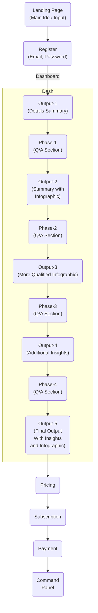

# Project Documentation

## Project Flow

```mermaid
flowchart TD
    A("Landing Page
    (Main Idea Input)")
    B("Register
    (Email, Password)")
    C("Phase-1
    (Q/A Section)")
    D("Phase-2
    (Q/A Section)")
    E("Phase-3
    (Q/A Section)")
    F("Phase-4
    (Q/A Section)")
    G("Output-1
    (Details Summary)")
    H("Output-2
    (Summary with
    Infographic)")
    I("Output-3
    (More Qualified Infographic)")
    J("Output-4
    (Additional Insights)")
    K("Output-5
    (Final Output
    With Insights
    and Infographic)")
    L("Pricing")
    M("Subscription")
    N("Payment")
    O("Command
    Panel")

    A --> B
    B --" Dashboard "--> G
    subgraph Dash
    G --> C
    C --> H
    H --> D
    D --> I
    I --> E
    E --> J
    J --> F
    F --> K
    end
    K --> L
    L --> M
    M --> N
    N --> O
```
